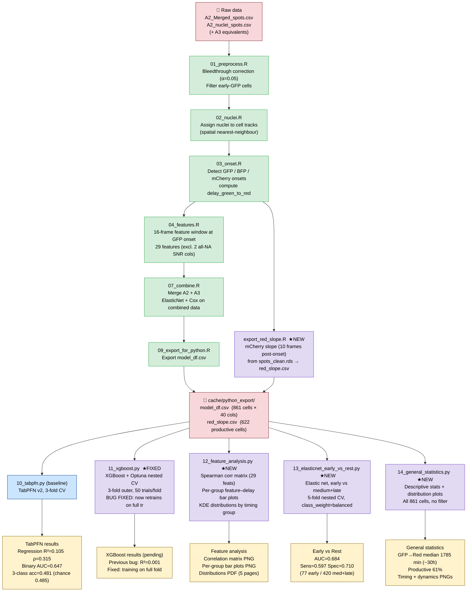

# HCMV Live Imaging — Analysis Pipeline

## Legend
- 🟢 Green boxes — existing R pipeline scripts
- 🟣 Purple boxes — new scripts written this session (★NEW) or fixed (★FIXED)
- 🔵 Blue — existing Python baseline (TabPFN)
- 🟡 Yellow — results
- 🔴 Red — data files
